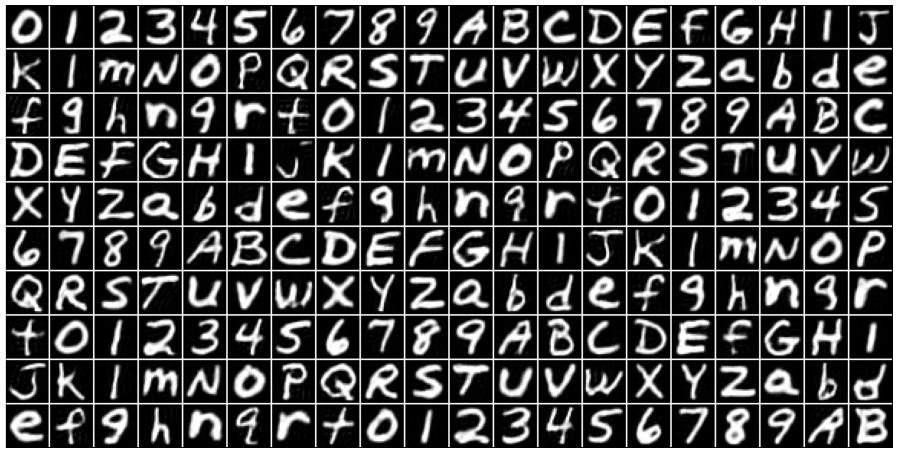

# MNIST/EMNIST/FashionMNIST

Diffusion model implementation in pytorch trained on the latent space of an autoencoder.

I built this as a personal project to practice using pytorch-lightning and training variational autoencoders (VAEs) and flow/diffusion models.

<div align="center">
  
  <figcaption><em>Figure 1. Generated EMNIST samples.</em></figcaption>
  <br><br>
</div>

The flow/diffusion model is not trained on the images directly but on the latent space of an autoencoder/VAE. This allows the generation process to run on CPU and it means we must use the decoder after the SDE integration to get a sample image.

<div align="center">
  
</div>

## Usage

Run these directly to test the repository functionality. For training, data will be downloaded into a `data/` folder by default.

### Generate synthetic images using pre-trained models

`python src generate --dataset EMNIST --model autoencoder`

### Training
- train autoencoder/VAE:

`python src train --dataset MNIST --model autoencoder` or `--model vae`

- make dataset of autoencoder's latent space:

`python src encode-dataset --dataset MNIST --model vae`

- train flow model in the latent space:

`python src train --dataset MNIST --model flow`

### Testing
Calculate prediction accuracy of the autoencoder/vae + flow models using Bayes rule:

$$p(y | x) \propto p(x | y) p(y)$$

`python src test --dataset EMNIST --model autoencoder`

### Testing autoencoder/VAE
Plot multiple images with their reconstructions

`python src test-reconstruction --dataset MNIST --model vae`

## Available pre-trained models

Models are stored in e.g. `parameters/MNIST/` by default. The weights are in e.g. `Diffusion.pth`, and the arguments to initialize the model are saved as a dict in `Diffusion.pickle`.

All models were trained in a single NVIDIA RTX 4070.

### MNIST

- VarAutoEncoder (350 KB): trained using `lr=0.005`, `total_epochs=10`, `alpha=0.15`. Achieves (test average) `KL_loss = 28.9` and `MSE_loss = 7.1`.

- Diffusion (70 KB): trained using `lr=0.001`, `total_epochs=10`.

The pair achieves 88.1% classification accuracy in the test set.

### EMNIST

- AutoEncoder (0.9 MB): trained using `lr=0.004`, `total_epochs=30`, `milestones=[15, 20, 25]`, `gamma=0.4`. Achieves (test average) `L1_loss = 25.9` and `MSE_loss = 3.6`.

- Diffusion (0.1 MB): trained using `lr=0.004`, `total_epochs=20`, `milestones=[10, 15]`, `gamma=0.4`.

The pair achieves 53.7% classification accuracy in the test set.

## Command Line Interface

The project can be run from the terminal with different modes. Each mode has its own arguments, but many arguments are shared.

### Common Arguments

These flags work in most modes:

- `--dataset {MNIST, EMNIST, FashionMNIST}` - which dataset to use.

- `--model {autoencoder, vae, flow}` - model architecture. Decides whether to use the pre-trained autoencoder or VAE, except in `mode=train` where it determines which model to train.

- `--model-version {dev, main}` - which checkpoint to use:
    - None: don't load parameters. default in `mode=train`.
    - dev: scratch / development checkpoint. It's overwritten each training epoch.
    - main: main checkpoint. User decides if overwriting it at the end of training. Default in all other modes.

- `--root (default: data)` - root directory for datasets and parameters.

- `--batch-size (default: 128)` - batch size for DataLoaders.

- `--split {balanced, byclass, bymerge} (default: balanced)` - EMNIST split. Ignored for MNIST / FashionMNIST.

### Training (train)

Trains a model.

- All common arguments

- `--lr (default: 1e-3)` - learning rate.

- `--total-epochs (default: 10)`

- `--num-workers (default: 0)` - dataloader workers.

- `--milestones (default: [])` - epochs where to decrease learning rate.

- `--gamma (default: 0.2)` - learning rate decay factor at each milestone.

- `--alpha (default 0.2)` - weight of KE loss vs MSE loss in VAEs.

- `--device (default cpu)` - device to use for the models

### Testing (test)
Tests a trained model.

- All common arguments.

- `--num-workers (default: 0)`

- `--autoencoder-version {dev, main} (default: main)` - which autoencoder checkpoint to use.

### Encode Dataset (encode-dataset)
Encodes a dataset using a trained autoencoder/VAE.

- All common arguments.

### Generation (generate)
Generates samples using a diffusion model and an autoencoder/VAE.

- All common arguments.

- `--height (default: 8)` - grid height.

- `--width (default: 8)` - grid width.

- `--scale (default: 0.8)` - scaling factor for plotting.

- `--weight (default: 3)` - classifier-free guidance weigth.

- `--diffusion (default: 0.5)` - noise level in diffusion. Corresponds to $\sigma(t) = \text{diffusion} \cdot (1 - t)$.

- `--autoencoder-version {dev, main} (default: main)`

### Reconstruction (test-reconstruction)
Reconstructs images from a dataset using an autoencoder/VAE.

- All common arguments.

- `--height (default: 8)`

- `--width (default: 8)`

- `--scale (default: 0.8)`

### Extra arguments
Any unknown arguments passed to the CLI are forwarded to the model constructor. For example:

```python src train --dataset MNIST --model autoencoder --dim1 64 --n_layers 3```

will instantiate the autoencoder with `dim1=64` and `n_layers=3`.
